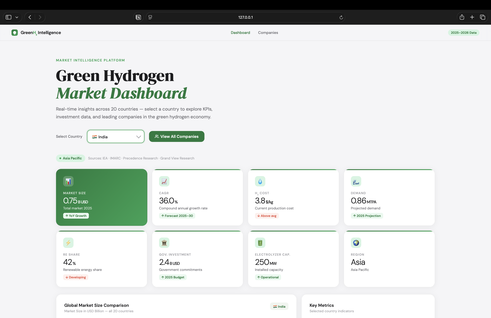
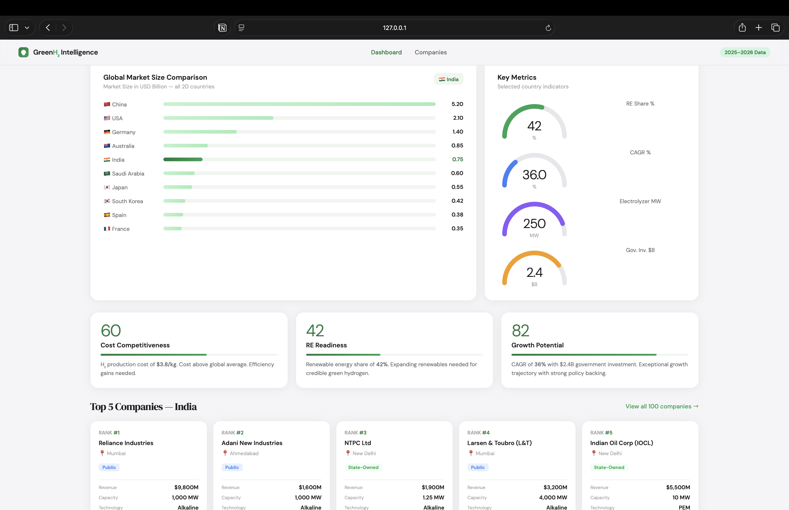
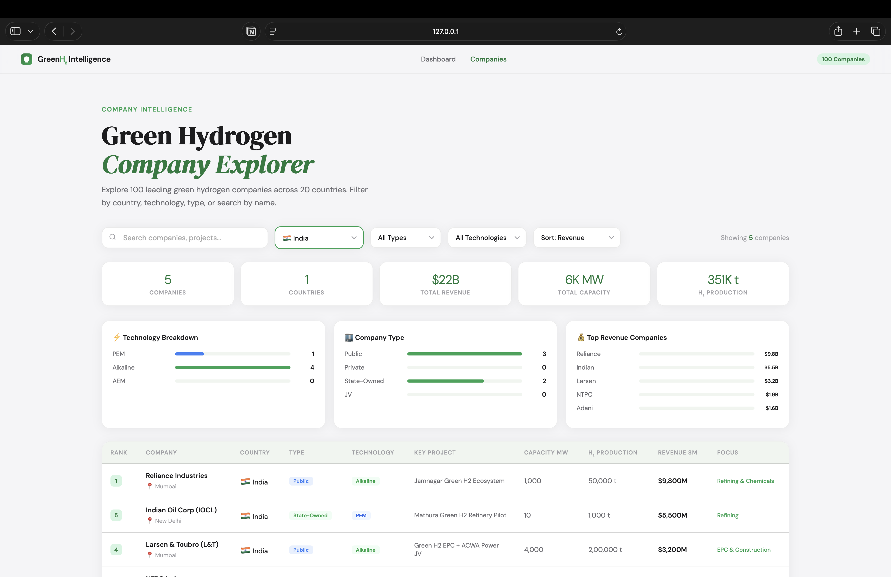
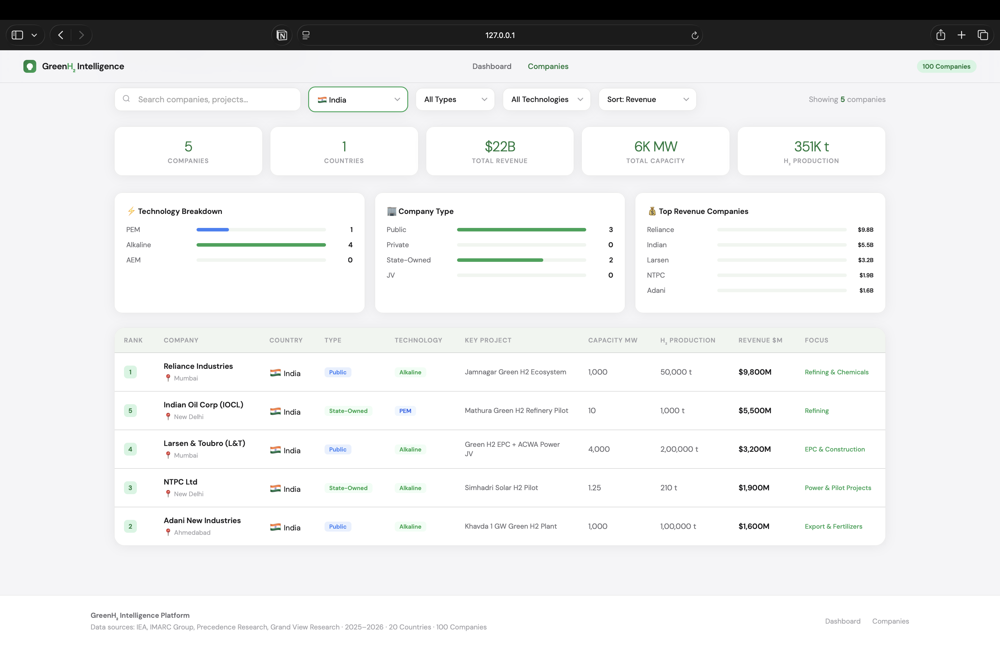

# Green Hydrogen Market Dashboard

A modern interactive dashboard for analyzing the global green hydrogen market across 20 countries using real market intelligence data from 2025–2026.

---
# Live Website
https://umarfareed21.github.io/green-hydrogen-market-dashboard/
---

# Demo

<p align="center">
  
</p>

<p align="center">
  <a href="https://umarfareed21.github.io/green-hydrogen-market-dashboard/">
    🌐 Live Demo
  </a>
  •
  <a href="https://youtu.be/8txNBleSq9k">
    🎥 YouTube Video
  </a>
</p>

---

# Overview

This project provides a clean and professional market intelligence platform.

The dashboard allows users to explore:

- Global green hydrogen market size
- Country-wise market comparison
- Government investments
- Electrolyzer capacity
- Hydrogen demand projections
- CAGR growth trends
- Top green hydrogen companies
- Technology distribution (PEM, Alkaline, AEM)

The project is built using pure HTML, CSS, and JavaScript without external frameworks.

---

# Features

## Dashboard
- Interactive country selector
- KPI cards with market metrics
- Global market comparison charts
- Country ranking table
- Responsive modern UI
- Apple-inspired design system

## Company Explorer
- Explore 100 green hydrogen companies
- Search companies instantly
- Filter companies by:
  - Country
  - Technology
  - Company Type
- Sort companies by:
  - Revenue
  - Capacity
  - Hydrogen Production

---

# Technologies Used

- HTML5
- CSS3
- JavaScript (Vanilla JS)

---

# Data Sources

The dataset was created using publicly available market research and industry reports from:

- IEA (International Energy Agency)
- IMARC Group
- Precedence Research
- Grand View Research

---

# Dataset Information

- All market and company data used in this project is stored directly inside JavaScript files as JavaScript objects and arrays.
- The website does not use Excel files, databases, APIs, or external backend services.
- The dashboard is fully frontend-based and runs entirely in the browser.

---

# Project Structure

```text
green-hydrogen-market-dashboard/
│
├── index.html
├── companies.html
├── README.md
│
├── css/
│   ├── style.css
│   └── companies.css
│
├── js/
│   ├── script.js
│   └── companies.js
│
└── assets/
    │
    ├── favicon-logo/
    │   └── favicon.png
    │
    ├── screenshots/
    │   ├── dashboard-home.png
    │   ├── dashboard-home-1.png
    │   ├── company-explorer.png
    │   └── company-explorer-1.png
    │
    └── screen-recordings/
        └── green-hydrogen-dashboard-demo.mov
```

---

# Screenshots

## Market Dashboard Overview


## Market Analytics & Insights


## Green Hydrogen Company Explorer


## Company Intelligence Dashboard


---


# How to Run

1. Download or clone the repository
2. Open the project folder
3. Run `index.html` in your browser

No installation or dependencies required.

---

# Author

Mohammad Umar Fareed

---
# Disclaimer

The data presented in this project is collected from publicly available industry reports and research sources for educational and portfolio purposes only.

While efforts were made to maintain accuracy, some figures may represent estimates, projections, or simplified market interpretations. This project should not be considered official financial, investment, or policy advice.

---

# License

This project is for educational and portfolio purposes.

